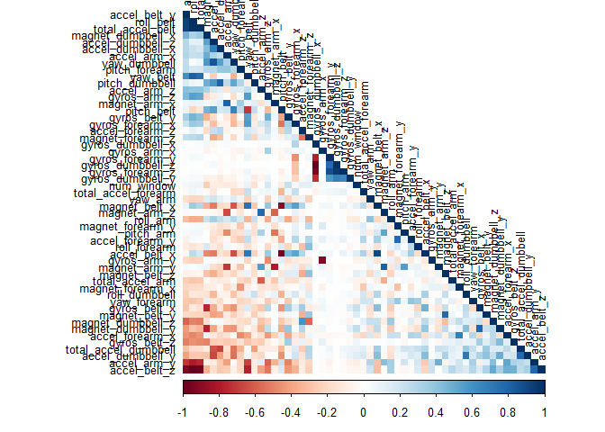
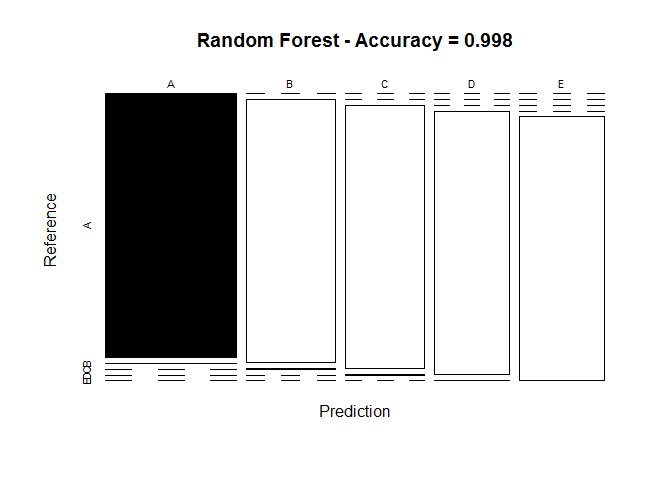
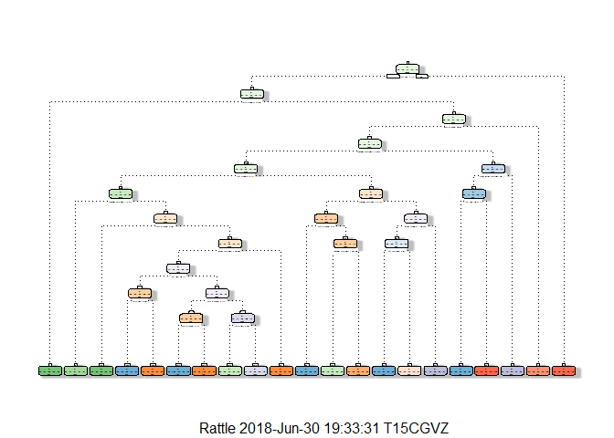
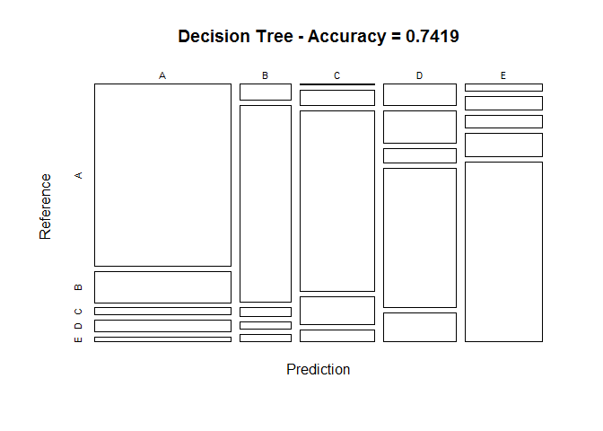

# Objective 

The goal of your project is to predict the manner in which they did the exercise. This is the “classe” variable in the training set. You may use any of the other variables to predict with. You should create a report describing how you built your model, how you used cross validation, what you think the expected out of sample error is, and why you made the choices you did. You will also use your prediction model to predict 20 different test cases.

# Loading the libraries


```
## Loading required package: lattice
```

```
## Loading required package: ggplot2
```

```
## randomForest 4.6-14
```

```
## Type rfNews() to see new features/changes/bug fixes.
```

```
## 
## Attaching package: 'randomForest'
```

```
## The following object is masked from 'package:ggplot2':
## 
##     margin
```

```
## Rattle: A free graphical interface for data science with R.
## Version 5.1.0 Copyright (c) 2006-2017 Togaware Pty Ltd.
## Type 'rattle()' to shake, rattle, and roll your data.
```

```
## 
## Attaching package: 'rattle'
```

```
## The following object is masked from 'package:randomForest':
## 
##     importance
```

```
## corrplot 0.84 loaded
```

```
## Loading required package: survival
```

```
## 
## Attaching package: 'survival'
```

```
## The following object is masked from 'package:rpart':
## 
##     solder
```

```
## The following object is masked from 'package:caret':
## 
##     cluster
```

```
## Loading required package: splines
```

```
## Loading required package: parallel
```

```
## Loaded gbm 2.1.3
```

# Loading the data 


```r
UrlTrain <- "http://d396qusza40orc.cloudfront.net/predmachlearn/pml-training.csv"
UrlTest  <- "http://d396qusza40orc.cloudfront.net/predmachlearn/pml-testing.csv"

# download the datasets
training <- read.csv(url(UrlTrain))
testing  <- read.csv(url(UrlTest))

# create a partition with the training dataset 
inTrain  <- createDataPartition(training$classe, p=0.7, list=FALSE)
TrainSet <- training[inTrain, ]
TestSet  <- training[-inTrain, ]
dim(TrainSet)
```

```
## [1] 13737   160
```

# Cleaning the Data

Remove all columns that contains NA and remove features that are not in the testing dataset. The features containing NA are the variance, mean and standard devition (SD) within each window for each feature. Since the testing dataset has no time-dependence, these values are useless and can be disregarded. We will also remove the first 7 features since they are related to the time-series or are not numeric


```r
# remove variables with Nearly Zero Variance
NZV <- nearZeroVar(TrainSet)
TrainSet <- TrainSet[, -NZV]
TestSet  <- TestSet[, -NZV]
dim(TrainSet)
```

```
## [1] 13737   106
```


```r
AllNA    <- sapply(TrainSet, function(x) mean(is.na(x))) > 0.95
TrainSet <- TrainSet[, AllNA==FALSE]
TestSet  <- TestSet[, AllNA==FALSE]
dim(TrainSet)
```

```
## [1] 13737    59
```


```r
# remove identification only variables (columns 1 to 5)
TrainSet <- TrainSet[, -(1:5)]
TestSet  <- TestSet[, -(1:5)]
dim(TrainSet)
```

```
## [1] 13737    54
```

```r
dim(TrainSet)
```

```
## [1] 13737    54
```

With the cleaning process above, the number of variables for the analysis has been reduced.

# Correlation Analysis

A correlation among variables is analysed before proceeding to the modeling procedures.


```r
corMatrix <- cor(TrainSet[, -54])
corrplot(corMatrix, order = "FPC", method = "color", type = "lower", 
         tl.cex = 0.8, tl.col = rgb(0, 0, 0))
```

<!-- -->

The highly correlated variables are shown in dark colors in the graph above. To make an evem more compact analysis, a PCA (Principal Components Analysis) could be performed as pre-processing step to the datasets. Nevertheless, as the correlations are quite few, this step will not be applied for this assignment.

# Prediction Model Building

Three methods will be applied to model the regressions (in the Train dataset) and the best one (with higher accuracy when applied to the Test dataset) will be used for the quiz predictions. The methods are: Random Forests, Decision Tree and Generalized Boosted Model, as described below.
A Confusion Matrix is plotted at the end of each analysis to better visualize the accuracy of the models.

# Random Forest


```r
set.seed(12345)
controlRF <- trainControl(method="cv", number=3, verboseIter=FALSE)
modFitRandForest <- train(classe ~ ., data=TrainSet, method="rf",
                          trControl=controlRF)
modFitRandForest$finalModel
```

```
## 
## Call:
##  randomForest(x = x, y = y, mtry = param$mtry) 
##                Type of random forest: classification
##                      Number of trees: 500
## No. of variables tried at each split: 27
## 
##         OOB estimate of  error rate: 0.23%
## Confusion matrix:
##      A    B    C    D    E  class.error
## A 3904    1    0    0    1 0.0005120328
## B    6 2649    3    0    0 0.0033860045
## C    0    5 2389    2    0 0.0029215359
## D    0    0    9 2243    0 0.0039964476
## E    0    0    0    4 2521 0.0015841584
```

```r
# prediction on Test dataset
predictRandForest <- predict(modFitRandForest, newdata=TestSet)
confMatRandForest <- confusionMatrix(predictRandForest, TestSet$classe)
confMatRandForest
```

```
## Confusion Matrix and Statistics
## 
##           Reference
## Prediction    A    B    C    D    E
##          A 1674    3    0    0    0
##          B    0 1136    5    0    0
##          C    0    0 1021    3    0
##          D    0    0    0  961    1
##          E    0    0    0    0 1081
## 
## Overall Statistics
##                                           
##                Accuracy : 0.998           
##                  95% CI : (0.9964, 0.9989)
##     No Information Rate : 0.2845          
##     P-Value [Acc > NIR] : < 2.2e-16       
##                                           
##                   Kappa : 0.9974          
##  Mcnemar's Test P-Value : NA              
## 
## Statistics by Class:
## 
##                      Class: A Class: B Class: C Class: D Class: E
## Sensitivity            1.0000   0.9974   0.9951   0.9969   0.9991
## Specificity            0.9993   0.9989   0.9994   0.9998   1.0000
## Pos Pred Value         0.9982   0.9956   0.9971   0.9990   1.0000
## Neg Pred Value         1.0000   0.9994   0.9990   0.9994   0.9998
## Prevalence             0.2845   0.1935   0.1743   0.1638   0.1839
## Detection Rate         0.2845   0.1930   0.1735   0.1633   0.1837
## Detection Prevalence   0.2850   0.1939   0.1740   0.1635   0.1837
## Balanced Accuracy      0.9996   0.9982   0.9973   0.9983   0.9995
```


```r
# plot matrix results
plot(confMatRandForest$table, col = confMatRandForest$byClass, 
     main = paste("Random Forest - Accuracy =",
                  round(confMatRandForest$overall['Accuracy'], 4)))
```

<!-- -->

# Decision Trees


```r
# model fit
set.seed(12345)
modFitDecTree <- rpart(classe ~ ., data=TrainSet, method="class")
fancyRpartPlot(modFitDecTree)
```

<!-- -->


```r
# prediction on Test dataset
predictDecTree <- predict(modFitDecTree, newdata=TestSet, type="class")
confMatDecTree <- confusionMatrix(predictDecTree, TestSet$classe)
confMatDecTree
```

```
## Confusion Matrix and Statistics
## 
##           Reference
## Prediction    A    B    C    D    E
##          A 1495  255   60   93   43
##          B   49  611   29   24   23
##          C    3   69  816  127   55
##          D   94  142   63  611  128
##          E   33   62   58  109  833
## 
## Overall Statistics
##                                          
##                Accuracy : 0.7419         
##                  95% CI : (0.7305, 0.753)
##     No Information Rate : 0.2845         
##     P-Value [Acc > NIR] : < 2.2e-16      
##                                          
##                   Kappa : 0.672          
##  Mcnemar's Test P-Value : < 2.2e-16      
## 
## Statistics by Class:
## 
##                      Class: A Class: B Class: C Class: D Class: E
## Sensitivity            0.8931   0.5364   0.7953   0.6338   0.7699
## Specificity            0.8929   0.9737   0.9477   0.9132   0.9455
## Pos Pred Value         0.7682   0.8302   0.7626   0.5886   0.7607
## Neg Pred Value         0.9546   0.8975   0.9564   0.9272   0.9480
## Prevalence             0.2845   0.1935   0.1743   0.1638   0.1839
## Detection Rate         0.2540   0.1038   0.1387   0.1038   0.1415
## Detection Prevalence   0.3307   0.1251   0.1818   0.1764   0.1861
## Balanced Accuracy      0.8930   0.7550   0.8715   0.7735   0.8577
```


```r
# plot matrix results
plot(confMatDecTree$table, col = confMatDecTree$byClass, 
     main = paste("Decision Tree - Accuracy =",
                  round(confMatDecTree$overall['Accuracy'], 4)))
```

<!-- -->

# Generalized Boosted Model


```r
# model fit
set.seed(12345)
controlGBM <- trainControl(method = "repeatedcv", number = 5, repeats = 1)
modFitGBM  <- train(classe ~ ., data=TrainSet, method = "gbm",
                    trControl = controlGBM, verbose = FALSE)
```


```r
# prediction on Test dataset
predictGBM <- predict(modFitGBM, newdata=TestSet)
confMatGBM <- confusionMatrix(predictGBM, TestSet$classe)
confMatGBM
```

```
## Confusion Matrix and Statistics
## 
##           Reference
## Prediction    A    B    C    D    E
##          A 1674    9    0    0    0
##          B    0 1114   12    5    3
##          C    0   12 1003    7    2
##          D    0    1   11  950    6
##          E    0    3    0    2 1071
## 
## Overall Statistics
##                                           
##                Accuracy : 0.9876          
##                  95% CI : (0.9844, 0.9903)
##     No Information Rate : 0.2845          
##     P-Value [Acc > NIR] : < 2.2e-16       
##                                           
##                   Kappa : 0.9843          
##  Mcnemar's Test P-Value : NA              
## 
## Statistics by Class:
## 
##                      Class: A Class: B Class: C Class: D Class: E
## Sensitivity            1.0000   0.9781   0.9776   0.9855   0.9898
## Specificity            0.9979   0.9958   0.9957   0.9963   0.9990
## Pos Pred Value         0.9947   0.9824   0.9795   0.9814   0.9954
## Neg Pred Value         1.0000   0.9947   0.9953   0.9972   0.9977
## Prevalence             0.2845   0.1935   0.1743   0.1638   0.1839
## Detection Rate         0.2845   0.1893   0.1704   0.1614   0.1820
## Detection Prevalence   0.2860   0.1927   0.1740   0.1645   0.1828
## Balanced Accuracy      0.9989   0.9869   0.9866   0.9909   0.9944
```

```r
modFitGBM$finalModel
```

```
## A gradient boosted model with multinomial loss function.
## 150 iterations were performed.
## There were 53 predictors of which 41 had non-zero influence.
```


```r
# plot matrix results
plot(confMatGBM$table, col = confMatGBM$byClass, 
     main = paste("GBM - Accuracy =", round(confMatGBM$overall['Accuracy'], 4)))
```

<!-- -->

# Applying the Selected Model to the Test Data

The accuracy of the 3 regression modeling methods above are:

- Random Forest : 0.9986
- Decision Tree : 0.7449
- GBM : 0.9898

In that case, the Random Forest model will be applied to predict the 20 quiz results (testing dataset) as shown below.


```r
predictTEST <- predict(modFitRandForest, newdata=testing)
predictTEST
```

```
##  [1] B A B A A E D B A A B C B A E E A B B B
## Levels: A B C D E
```

# Submission file
As can be seen from the confusion matrix the Random Forest model is very accurate, about 99%. Because of that we could expect nearly all of the submitted test cases to be correct. It turned out they were all correct.

Prepare the submission


```r
pml_write_files = function(x){
  n = length(x)
  for(i in 1:n){
    filename = paste0("problem_id_",i,".txt")
    write.table(x[i],file=filename,quote=FALSE,row.names=FALSE,col.names=FALSE)
  }
}

pml_write_files(predictTEST)
```
